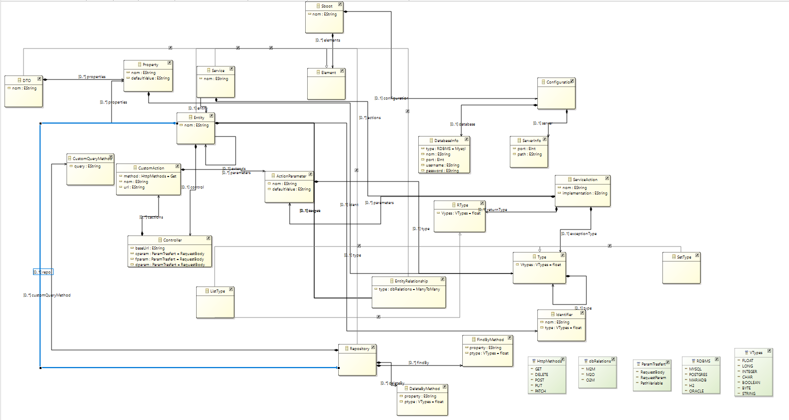
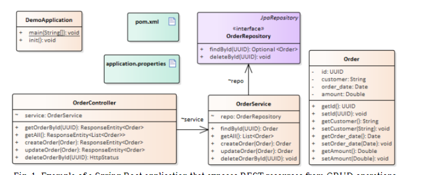
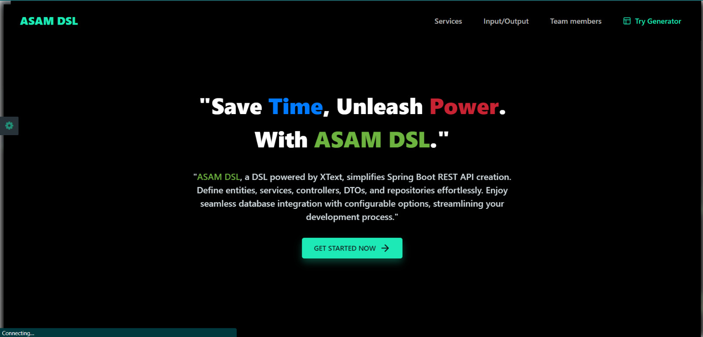
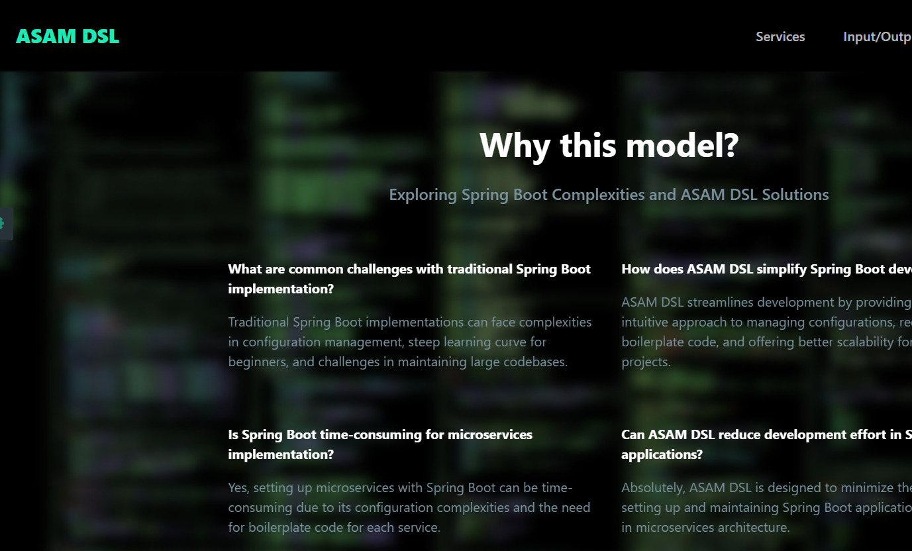
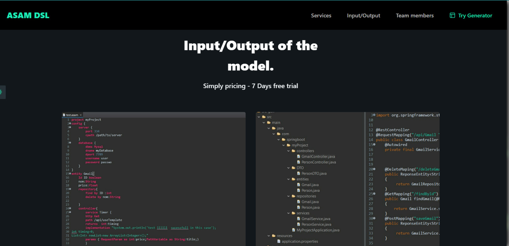
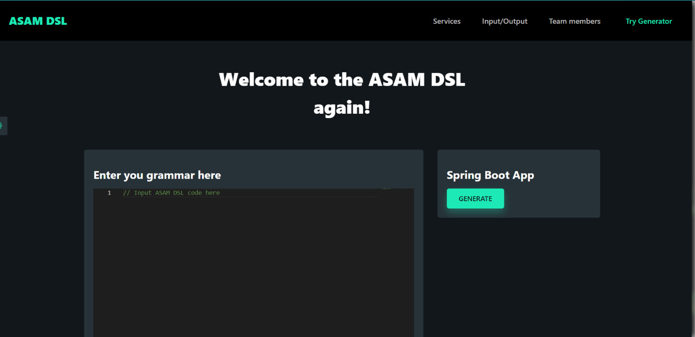

## DSL for spring boot restful APIs generation ***ASAM DSL***
### *Introduction*
Model-Driven Engineering (MDE) is an approach to software development that emphasizes the use of models to design and implement systems. In MDE, abstract representations, or models, capture the essential aspects of a system, ranging from its structure to its behavior. These models serve as a foundation for generating executable code, documentation, and other artifacts, streamlining the development process and fostering higher-level abstractions. Domain-Specific Languages (DSLs) play a pivotal role in MDE, providing specialized, expressive syntax tailored to a particular problem domain. DSLs allow developers to articulate solutions in a language that closely aligns with the concepts of their specific application domain, enabling more intuitive and efficient development within that context. Together, MDE and DSLs contribute to increased productivity, code quality, and maintainability by promoting a model-centric and domain-specific approach to software engineering.
### *problem formalization*
Building spring boot applications is task that full stack and software developers do almost every day,
also these  applications have many similarities in terms of business logic,entities and also dependencies,other side most of the real world 
developed applications are built on the top of a basic crud architecture.Therefore,we thought that if the core of the majority of spring boot 
applications remains the same then a unified approach that a primitive spring boot ground containing the basics  restfull apis that provides 
the necessary logic for crud manipulations.

### *solution*
In our pursuit of formal tooling, we have identified that Model Driven Engineering (MDE) aligns well with the objectives of addressing the challenges 
faced by ASAM DSL. The aim of ASAM DSL is to streamline the development process by providing a high-level Domain-Specific Language (DSL) that reduces 
redundancy and simplifies the generation of basic code.
Under the umbrella of ASAM DSL, we propose an integrated solution employing Model Driven Engineering principles. This solution, also named ASAM DSL, 
offers a unified approach for creating CRUD (Create, Read, Update, Delete) RESTful APIs . Leveraging MDE methodologies the solution will enable  model-to-model 
transformations and model-to-text transformations.
ASAM solution is now on the beginning of the way as the objectives is tio cover many aspects of spring boot functionnalities and features.The first Version of ASAM is now targeting crud restfull apis in a monolyth architecture,but for sure the next versions would support :
##### <li> unit test
##### <li> integration tests
##### <li> batch processing 
##### <li> IAM(identity and access management ) 
##### <li> different software architectures(serverless,microservices,event-driven,Master-slave....)......

### *ASAM DSL as dsl/solution architecture*
##### <li>1-DSL Input:

>ASAM DSL allows the definition of Spring Boot RESTful APIs through a concise and expressive syntax. The DSL encompasses various aspects of API development, including project configuration, entity modeling,      >data >transfer objects (DTOs), controllers, repositories, and custom actions.

>##### <li>Project Definition:
>Define a Spring Boot project using the 'project' keyword, specifying the project name ('nom') and optional configuration settings.

>##### <li>Entity Modeling:
>Entities are defined using the 'entity' keyword, specifying the entity name ('nom'), identifier details, properties, repository, and controller.

>##### <li>Data Transfer Objects (DTOs):
>DTOs are defined using the 'dto' keyword, specifying the DTO name ('nom') and its properties.

>##### <li>Controllers:
>Controllers are defined using the 'controller' keyword, allowing the specification of base URLs, custom actions, and CRUD operations.

>##### <li>Custom Actions:
>Custom actions are defined using the 'service' keyword, providing details such as HTTP method, path, return type, implementation, and parameters.

>##### <li>Repositories:
>Repositories are defined using the 'repository' keyword, encompassing custom query methods, 'find by' methods, and 'delete by' methods.

>##### <li>Configuration:
>Configuration settings, including server and database details, are defined using the 'config' keyword.

>##### <li>Data Types:
>Various data types, including primitive types and enumerations, are supported.

>##### <li>Relationships:
>Entity relationships, such as Many-to-Many ('M2M'), Many-to-One ('M2O'), and One-to-Many ('O2M'), can be specified.

>##### <li>HTTP Methods and Database Types:
>HTTP methods ('GET', 'POST', 'PUT', 'DELETE', 'PATCH') and database types (e.g., 'MYSQL', 'POSTGRES') are supported.

>##### <li>Parameter Transfer Types:
>Different parameter transfer types, such as 'RequestBody', 'RequestParam', and 'PathVariable', are available for custom actions.

>##### <li>Validation and Defaults:
>Validation constraints and default values for properties can be specified.

>The DSL aims to provide a declarative and intuitive syntax for describing the structure and behavior of Spring Boot RESTful APIs, facilitating rapid development and easy customization.

##### <li> 2-MetaModel Definition:
>In the context of Model-Driven Engineering (MDE), a meta-model serves as a foundational abstraction that defines the structure and semantics of a modeling language. In our DSL for Spring Boot RESTful API generation, the meta-model acts as a conceptual framework, capturing the essential concepts and relationships inherent to the representation of a software project.
>ASAM is defined under the meta model represented below: 

##### <li>3-Grammar building:
>The gramar to align with the dedicated meta-model,it enables the precise representation of key project elements in a textual format. Developers can articulate project structures, including entities, data transfer objects (DTOs), repositories, and their relationships, employing an intuitive syntax. Configuration settings, server specifications, and database details are seamlessly integrated, ensuring comprehensive project definitions. This grammar acts as a bridge between the high-level abstraction provided by the DSL and the underlying meta-model, facilitating the creation of Spring Boot applications through a concise and expressive textual syntax.
>our grammar is the follwing:
<pre>
    grammar org.xtext.example.asam.Asam with org.eclipse.xtext.common.Terminals;
    
    generate asam "http://www.xtext.org/example/asam/Asam"
    
    Sboot:
        'project' nom=ID
        configuration=Configuration?
        elements+=Element*;
    
    Element:
        Entity | DTO | Repository | EntityRelationship ;
    
    EntityRelationship:
        'relation' type=dbRelations 'between' source=[Entity] 'and' target=[Entity];
    
    Configuration:
        'config' '{'
            server=ServerInfo?
            database=DatabaseInfo
        '}';
    
    ServerInfo:
        'server' '{'
            ('port' port=INT)
            ('cpath' path=PATH)?
        '}';
    
    DatabaseInfo:
        'database' '{'
            'dbms' type=RDBMS
            'dname' nom=ID
            'dport' port=INT
            'username' username=ID
            'password' password=ID
        '}';
    
    Entity:
        'entity' nom=ID ('inherits' extends=[Entity])? '{'
            ident=Identifier
            properties+=Property*
            repo=Repository?
            control=Controller
        '}';
    
    Identifier:
        'Id' nom=ID type=VTypes;
    
    DTO:
        'dto' nom=ID '{'
            properties+=Property*
        '}';
    
    Controller:
        'controller'  '{'
            baseUrl=PATH?
            cactions+=CustomAction*
            ('create' 'entity:' cparam=ParamTrasfert )?
            ('find' 'entity:' fparam=ParamTrasfert)?
            ('delete' 'entity:' dparam=ParamTrasfert)?
         '}';
    
    CustomAction:
        'service' nom=ID '{'
            'http' method=HttpMethods 
            'path' spath=PATH
            'returns' returnType=RType ':' returnName=ID
            ('implementation' implementation=STRING)?
            'params' '(' (parameters+=ActionParameter)* ')'
        '}';
    
    ActionParameter:
        httpM=ParamTrasfert 'as'  type=Type ':' nom=ID';' ;
    
    Repository:
        'repository'  '{'
            findBy+=FindByMethod*
            deleteBy+=DeleteByMethod*
            customQueryMethod+=CustomQueryMethod*
        '}';
    
    FindByMethod:
        'find' 'by' property=ID':' ptype=VTypes;
    
    DeleteByMethod:
        'delete' 'by' property=ID':' ptype=VTypes;
    
    CustomQueryMethod:
        'customQuery' '{' query=STRING '}';
    
    Property:
        nom=ID ':' type=Type ('default' defaultValue=STRING)?;
    
    Type:
        Vtypes=VTypes | ListType | SetType;
    
    RType:
        Vypes=VTypes | ListType | ID;
    
    ListType: 'List<' type=Type '>';
    SetType: 'Set<' type=Type '>';
    
    terminal PATH: ('/' ('a'..'z' | 'A'..'Z') ('a'..'z' | 'A'..'Z' | '0'..'9' | '_')*)*;
    
    enum VTypes  : FLOAT='float' | LONG="long" | INTEGER="int" | CHAR="char" | BOOLEAN="boolean" | BYTE="byte" | STRING="String";
    
    enum HttpMethods: GET="Get" | DELETE="Delete" | POST="Post" | PUT="Put" | PATCH="Patch";
    
    enum RDBMS: MYSQL="Mysql" | POSTGRES="Postgres" | MARIADB="Mariadb" | H2="h2" | ORACLE="Oracle";
    
    enum dbRelations: M2M="ManyToMany" | M2O="ManyToOne" | O2M="OneToMany";
    enum ParamTrasfert: RequestBody="RequestBody" | RequestParam="RequestParam" | PathVariable="PathVariable";
</pre>
##### <li>4-Validation:
>In our Xtext DSL project for generating Spring Boot RESTful APIs, the validation step is a critical phase ensuring both syntactic and semantic accuracy within our defined language. During validation, the Xtext framework meticulously analyzes the DSL code against our specified grammar rules and performs additional checks we've defined. This process is instrumental in identifying and preemptively addressing errors early in the development cycle, delivering immediate feedback to users as they compose code. The effectiveness of our validation significantly contributes to the reliability and maintainability of our DSL projects, ensuring strict adherence to our language specifications and preempting potential runtime issues. By rigorously enforcing consistency and correctness in our DSL code, the validation step serves as a linchpin in elevating the overall quality of our Xtext DSL project, cultivating a resilient and error-free environment tailored for generating robust Spring Boot RESTful APIs,there two types of validators are provided by the project: 
-Automatic Validation(Lexer/Parser: Syntactical Validation,Linker: Cross-reference Validation,Serializer: Concrete Syntax Validation) 
-Custom Validation

##### <li>5-Code Generation:
>In our Xtext DSL project for generating Spring Boot RESTful APIs, the code generation step is a pivotal process that translates high-level DSL representations into executable Spring Boot code.We used  the Xtend language   in order to  write the code  generator from the proposed DSL. Xtend is a statically-typed programming language that was initially released with Xtext. We wrote different code templates  in order to automatically generate all the Spring Boot Java files that were necessary. 
The code will be generated to repect the format of maven spring boot project for perfoming crud operation in a format that respect the best practices of basic spring boot monolyth project.The image Below is an example of an output format: 

##### <li>Web integration of ASAM:
>Web integration is one of the objectives of the project ,ASAM solution is designed to be accesible from a web applictaion that is already developped and closely would be in production the web interface is supposed to provide an intuitive interface to interact woth ASAM dsl and get result in jar file.
>The asam web solution is accessible from a web application that provide a presentation of the asam solution and key concepts manifested in the language ,and mainly give code editor that enable sthe users to write their code that  should respect asam dsl and as result the user could get the result of its code either as errors reports if the input doesn't respect asam syntax or a zip  that package the resulted spring boot project the web app is prsented in the folloing images images:
This is the highlighted text with a yellow background. 
><h1 color="red>**Main page of ASAM web APP:**</red>
>>>
><h1 color="red>**ASAM description:**</h2>
>>>
><h1 color="red>**ASAM input/output overview:**</h2>
>
><h1 color="red>**ASAM code editor:**</h1>h2>
>>>

### *Transformation M2T*
##### ASAM DSL Spring Boot Code Generation

ASAM solution use xtend language to implement a  Model-to-Text (M2T) transformation for generating code from a Domain-Specific Language (DSL) named ASAM. The resulting code is tailored for a Spring Boot application, incorporating Java Persistence API (JPA) entities, repositories, Data Transfer Objects (DTOs), controllers, services, and related configurations.
<pre>
    ##### Entity Generation (`generateEntityClass`)
    
    - Generates Java entity classes annotated with JPA annotations (`@Entity` and `@Table`).
    - Includes fields for each property specified in the ASAM DSL.
    
    ##### Repository Generation (`generateRepository`)
    
    - Creates Spring Data JPA repositories for each entity.
    - Repositories extend `JpaRepository` and include methods for basic CRUD operations and custom queries.
    
    ##### DTO Generation (`generateDtoClass`)
    
    - Generates DTOs based on DSL's DTO definitions.
    - Utilizes Lombok's `@Builder` annotation for a convenient builder pattern.
    - Generates getter and setter methods for each DTO property.
    
    ##### Controller and Service Generation (`generateController` and `generateService`)
    
    - Creates controllers and services for each entity.
    - Controllers handle HTTP requests, while services encapsulate business logic.
    - Generates methods in controllers for CRUD operations and custom actions specified in the DSL.
    
    ##### Properties File Generation (`generatePropertiesFile1`, `generatePropertiesH2`, `generatePropertiesOracle`)
    
    - Generates properties files to configure the Spring Boot application.
    - Different files are generated based on the specified database type in the DSL configuration.
    
    ##### POM.xml Generation (`generatePomXml`)
    
    - Generates the POM.xml file for Maven, including dependencies based on the chosen database type.
    
    ##### Test Folder Generation (`generateTestFolder`)
    
    - Generates a placeholder test class within the test folder.
    
    ##### Main Class Generation (`generateMainClass`)
    
    - Generates a main class for the Spring Boot application, including the `@SpringBootApplication` annotation.
    
    This M2T transformation automates the generation of boilerplate code, promoting consistency and reducing effort when setting up a new Spring Boot project based on the ASAM DSL specifications.

</pre>
    

### *Tools*
<pre>
    ##### Xtext

    - **Purpose:** Xtext is a language development framework that facilitates the creation of Domain-Specific Languages (DSLs) and their corresponding Integrated Development Environments (IDEs).
    - **Role in ASAM DSL Project:** Xtext is the core technology responsible for defining the syntax and semantics of ASAM DSL. It enables the creation of a textual DSL with specific grammar rules and supports         automatic generation of a rich and customizable editor for ASAM DSL.
    
    ##### Xtend
    
    - **Purpose:** Xtend is a programming language that compiles to Java source code. It is designed to be concise and expressive, providing additional features and enhancements compared to Java.
    - **Role in ASAM DSL Project:** Xtend is often used for writing code generation templates in the context of Model-to-Text (M2T) transformations. It allows  to generate CRUD operations and other code based on         the ASAM DSL models, enhancing the expressiveness and conciseness of your code.
    
    ##### EMF (Eclipse Modeling Framework)
    
    - **Purpose:** EMF is a modeling framework within the Eclipse ecosystem. It provides tools and runtime support for building and managing structured data models.
    - **Role in ASAM DSL Project:** EMF is likely used for defining and manipulating models in your project. It provides the infrastructure for creating, editing, saving, and loading models in a consistent way.         In the context of the ASAM DSL, EMF is essential for handling the underlying data structures that represent the DSL models.
    
    ##### ANTLR (ANother Tool for Language Recognition)
    
    - **Purpose:** ANTLR is a powerful parser generator that is sometimes used in combination with Xtext to define the lexer and parser rules for the DSL.
    - **Role in Xtext Projects:** ANTLR helps in specifying the grammar rules for the DSL, and Xtext can use ANTLR-generated parsers under the hood.
</pre>
### *Conclusion*
In conclusion, our ASAM DSL project leverages powerful tools and frameworks to streamline the development of Spring Boot RESTful APIs. Xtext serves as the backbone, empowering the creation of a Domain-Specific Language (DSL) with a tailored syntax and semantics. Xtend enhances expressiveness through concise code generation templates, while EMF ensures robust model handling within the Eclipse ecosystem. The integrated solution follows Model-Driven Engineering (MDE) principles, enabling seamless model-to-model and model-to-text transformations. Together, these technologies contribute to a cohesive, efficient, and maintainable approach for developing CRUD operations in Spring Boot, aligning perfectly with our project's objectives. Refer to the sections above for detailed information on each component, empowering you to dive into our DSL project with confidence.

